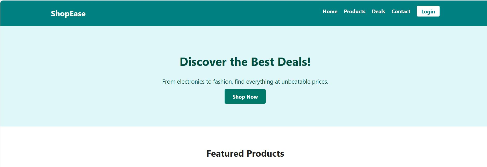
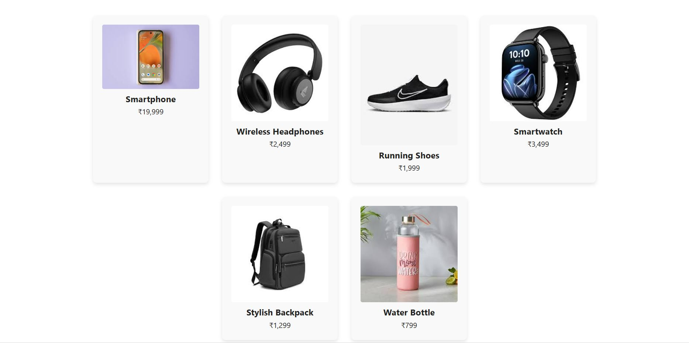
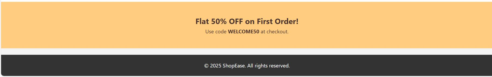

# 🛍️ E-Commerce Landing Page

This is a simple and aesthetic **E-Commerce Landing Page** created using **HTML** and **CSS**. It's designed as a beginner-friendly project to practice basic web development skills such as layout, styling, and responsiveness.

## 🚀 Features

- Responsive navigation bar
- Hero section with call-to-action
- Product showcase section
- Footer with basic links and branding
- Visually appealing design and hover effects

## 📁 Folder Structure

Landing_page/
├── index.html
├── style.css
├── smartphone.jfif
├── shoes.jfif
├── backpack.jfif
├── headphones.jfif
├── smartwatch.jfif
├── waterbottle.jfif
├── README.md

## 🛠️ Technologies Used

- HTML5
- CSS3
- VS Code
- Git & GitHub

## 📸 Preview

 

## 💡 What I Learned

- Structuring HTML sections (header, main, footer)
- Applying modern CSS styles
- Working with Flexbox
- Using Git and pushing to GitHub
- Deploying a static website via GitHub Pages

---

